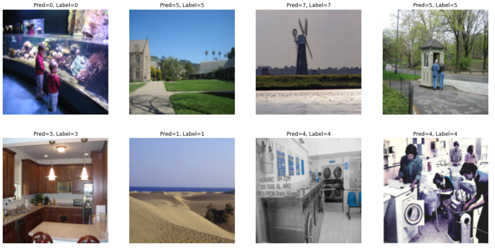

# Bag of Visual Words

[Bag of Visual Words](http://vision.stanford.edu/teaching/cs131_fall1718/files/14_BoW_bayes.pdf) implemented in Python.

## Requirements
The program requires the following libraries
1. Numpy
2. Pytorch
3. Sklearn
4. OpenCV
5. Matplotlib
6. Tqdm

## How to run
The `Bag of Visual Words.ipynb` notebook has the functions and the code for the algorithm. The code is run on the `SUN Dataset`. 

## Results

The above is a sample of the correct results of the `BOVW` algorithm.